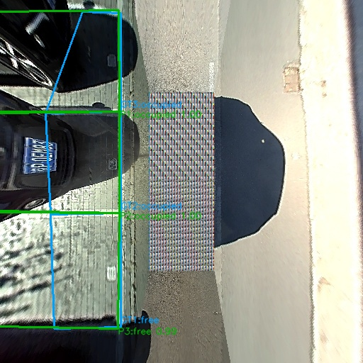
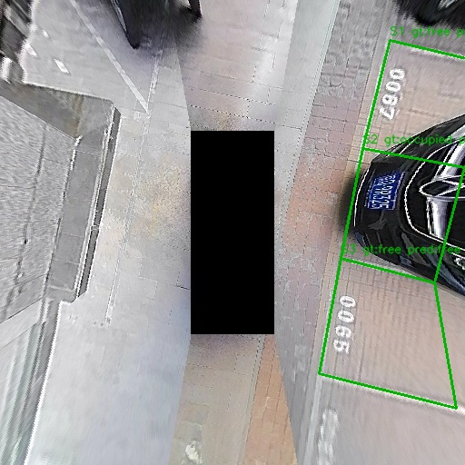
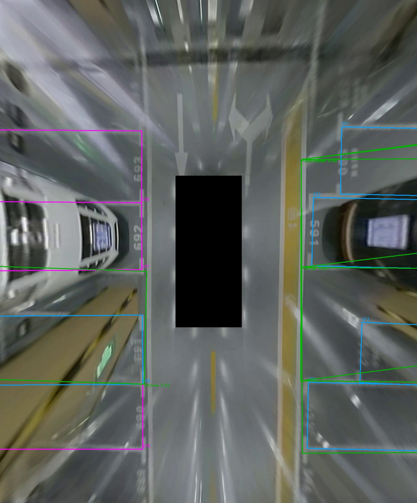

# Parking Slot Detection

Проект для детекции парковочных мест на surround-view / BEV изображениях и определения статуса занятости места.

Текущий рабочий пайплайн:

```text
кадр / последовательность кадров
  -> detector парковочных мест
  -> crop каждого найденного места
  -> EfficientNet-B0 classifier free / occupied
  -> preview, JSON, галереи crops, видео
```

## Текущее состояние

Главный вывод после последних экспериментов: CRPS-D marking-point detector оказался ограничен pairing/postprocess логикой, а YOLO-OBB на ParkRecon3D BEV резко поднял качество. Поэтому основной slot detector сейчас - YOLO-OBB, который сразу предсказывает повернутый четырехугольник парковочного места. CRPS-D остается baseline/fallback для сравнения.

В репозитории есть:

- базовый video pipeline в `src/main.py`;
- CRPS-D slot detector backend как baseline/fallback;
- YOLO-OBB slot detector backend;
- EfficientNet-B0 occupancy classifier;
- конвертеры ParkRecon3D BEV в CRPS-D-like и YOLO-OBB форматы;
- evaluation/QA скрипты для CRPS-D, ParkRecon3D BEV, temporal sequence и полного pipeline;
- Kaggle-инструкции для обучения CRPS-D fine-tune и YOLO-OBB.

Текущий лучший практический путь:

```text
ParkRecon3D BEV
  -> YOLO-OBB slot detector, conf около 0.55
  -> EfficientNet-B0 occupancy classifier
  -> visual QA / JSON / video
```

## Примеры

### CRPS-D, полный пайплайн



### CRPS-D, проверка occupancy classifier на GT-слотах



### ParkRecon3D BEV



## Структура проекта

```text
configs/
  default.yaml

src/
  main.py
  detection/
    parking_slot_detector.py       # mock / CRPS-D / YOLO-OBB slot detector
    vehicle_detector.py            # YOLO vehicle detector
    schemas.py
  occupancy/
    classifier.py                  # EfficientNet-B0 classifier
    estimator.py
    state_manager.py
  datasets/
    crpsd.py
  visualization/
    draw.py

scripts/
  train_occupancy_efficientnet.py
  evaluate_occupancy_classifier_crpsd.py
  evaluate_full_pipeline_crpsd.py
  evaluate_parkrecon3d_bev.py
  evaluate_parkrecon3d_temporal_slots.py
  convert_parkrecon3d_bev.py
  convert_parkrecon3d_yolo_obb.py
  prepare_parkrecon3d_camera_images.py
  visualize_parkrecon3d_resized_labels.py

docs/
  kaggle_yolo_obb.md
  kaggle_slot_detector_finetune.md
  parkrecon3d_camera_projection.md
  assets/
```

## Что не хранится в git

Большие файлы игнорируются:

```text
models/**/*.pt
models/**/*.pth
outputs/
external/
data/raw/
data/processed/
data/samples/*.mp4
```

Локально сейчас использовались такие веса:

```text
models/vehicle/yolo11n.pt
models/occupancy/efficientnet_b0_crpsd.pt
models/slot_detector/best_yolo_parkrecon.pt
models/slot_detector/parkrecon3d_slot_detector_finetuned.pth
```

Для CRPS-D backend нужен внешний репозиторий:

```text
external/CRPS-D
https://github.com/zzh362/CRPS-D
```

## Установка локально

Рекомендуется Python 3.10+.

```bash
python -m venv .venv
source .venv/bin/activate
pip install -r requirements.txt
```

Если нужен CRPS-D backend:

```bash
mkdir -p external
git clone https://github.com/zzh362/CRPS-D external/CRPS-D
```

Для YOLO-OBB нужен пакет `ultralytics`. Если его нет после установки requirements:

```bash
pip install ultralytics
```

## Конфиг

`configs/default.yaml` по умолчанию использует YOLO-OBB:

```yaml
parking_slot_detector:
  backend: "yolo_obb"
  model_path: "models/slot_detector/best_yolo_parkrecon.pt"
  device: "cuda"
  conf_threshold: 0.55
  imgsz: 1024
```

Temporal smoothing в дефолтном режиме выключен: он был экспериментом для CRPS-D, а YOLO-OBB уже дает стабильные слоты без восстановления marking-point пар.

Если CUDA недоступна, использовать `device: "cpu"`.

## Прогноз освобождения места

В проект добавлен эвристический модуль `src/occupancy/release_predictor.py`. Он не заменяет классификацию `free / occupied`, а поверх занятого места считает вероятность, что место скоро освободится.

Используемые признаки:

- `slot_vehicle_overlap` - коэффициент пересечения автомобиля с парковочным местом. Числовой порог зафиксирован в конфиге как `slot_vehicle_overlap_threshold: 0.20`.
- `motion_state` - анализ движения автомобиля по нескольким кадрам на основе истории центров track. Так система отличает стоящий автомобиль от машины, которая просто проезжает мимо.
- `pedestrian_nearby` - наличие пешехода рядом с автомобилем как признак возможной подготовки к выезду.
- `brake_lights_on` - эвристика стоп-сигналов: яркие красные области в нижней/задней части bbox автомобиля.
- `release_probability` - единый score, объединяющий overlap, движение, пешехода и стоп-сигналы.

Порог и веса настраиваются в `configs/default.yaml`:

```yaml
release_prediction:
  enabled: true
  slot_vehicle_overlap_threshold: 0.20
  pedestrian_near_distance_px: 90.0
  brake_light_red_ratio_threshold: 0.015
  parked_speed_threshold_px: 2.0
  moving_speed_threshold_px: 5.0
  motion_window: 5
  release_probability_threshold: 0.65
```

Если `release_probability` превышает порог и слот уже считается занятым, статус может перейти в `soon_free`. В JSON для каждого слота сохраняются `release_probability` и подробные `release_features`.

## Запуск demo pipeline

```bash
python src/main.py --config configs/default.yaml
```

Если `data/samples/demo.mp4` отсутствует, код создает synthetic demo video.

Результаты:

```text
outputs/videos/demo_result.mp4
outputs/json/demo_result.json
```

Быстрая regression-проверка camera fusion:

```bash
python -m unittest discover -s tests
```

Проверка покрывает near-filter vehicle detector, camera->slot matcher и temporal memory для camera evidence.

## Occupancy classifier

Статус занятости считает EfficientNet-B0:

```text
src/occupancy/classifier.py
```

Классы:

```text
free
occupied
```

Ожидаемый путь весов:

```text
models/occupancy/efficientnet_b0_crpsd.pt
```

Проверка на GT-слотах CRPS-D test:

```bash
python scripts/evaluate_occupancy_classifier_crpsd.py \
  --dataset-root /home/slomauh/CRPS-D/CRPS-D \
  --split test \
  --device cpu \
  --model-path models/occupancy/efficientnet_b0_crpsd.pt \
  --output-dir outputs/crpsd_occupancy_eval_test_full
```

Результат:

```text
images: 4376
slots: 12103
accuracy: 98.22%
occupied_f1: 98.53%
free_f1: 97.74%
```

Вывод: classifier на CRPS-D работает хорошо. На ParkRecon3D BEV честной occupancy accuracy пока нет, потому что в датасете нет GT `free/occupied`.

## CRPS-D full pipeline

Оценка полной связки на CRPS-D:

```bash
python scripts/evaluate_full_pipeline_crpsd.py \
  --dataset-root /home/slomauh/CRPS-D/CRPS-D \
  --split test \
  --device cpu \
  --slot-model-path /home/slomauh/pretrain_model/pretrain_model/1:2.pth \
  --occupancy-model-path models/occupancy/efficientnet_b0_crpsd.pt \
  --match-iou 0.10 \
  --output-dir outputs/crpsd_full_pipeline_eval_test_full_iou010
```

Результат:

```text
images: 4376
gt_slots: 12103
pred_slots: 11799
matched_slots: 10130

slot_recall: 83.70%
slot_precision: 85.85%
matched_occupancy_accuracy: 98.00%
end_to_end_slot_status_accuracy_over_gt: 82.02%
```

## ParkRecon3D BEV dataset

ParkRecon3D был подготовлен из локальных частей:

```text
/home/slomauh/Documents/data1
/home/slomauh/Documents/data2
/home/slomauh/Documents/data3
```

Используются BEV-изображения:

```text
<dataset_part>/BEV/Data/Image
<dataset_part>/BEV/Data/label
```

В labels есть геометрия парковочных мест:

```json
{
  "marks": [[x0, y0, x1, y1, type]],
  "slots": [[mark_a, mark_b, slot_type, angle]]
}
```

Важное ограничение: в ParkRecon3D labels нет статуса занятости.

Конвертация в CRPS-D-like формат:

```bash
python scripts/convert_parkrecon3d_bev.py \
  --dataset-roots \
    /home/slomauh/Documents/data1 \
    /home/slomauh/Documents/data2 \
    /home/slomauh/Documents/data3 \
  --output-dir outputs/parkrecon3d_bev_crpsd_format \
  --val-ratio 0.2 \
  --image-size 512 \
  --split-strategy chronological \
  --gap-size 30
```

Текущий split:

```text
total_pairs: 5005
duplicate_pairs_dropped: 429
train images: 3974
train slots: 15937
test images: 1001
test slots: 4786
dropped gap frames: 30
```

Проверка leakage:

```text
test with train neighbor <= 1 frame: 0/1001
test with train neighbor <= 10 frames: 0/1001
test with train neighbor <= 30 frames: 0/1001
min nearest frame distance: 31
dHash exact duplicates: 0
dHash near duplicates up to 8/256 bits: 0
```

## CRPS-D detector на ParkRecon3D

Изначальный pretrained CRPS-D detector без дообучения плохо переносился на ParkRecon3D BEV:

```text
30-frame smoke:
gt_slots: 118
pred_slots: 33
matched_slots: 21
slot_recall: 17.80%
slot_precision: 63.64%
```

После fine-tune и большого числа postprocess экспериментов лучший CRPS-D-like вариант уперся примерно в:

```text
recall:    77.48%
precision: 77.54%
F1:        77.51%
```

Основная проблема: модель предсказывает marking points, а pairing/postprocess иногда собирает поперечные ложные слоты или дубли. Поэтому CRPS-D backend оставлен как baseline/fallback, но не выглядит лучшим путем дальше.

## YOLO-OBB detector на ParkRecon3D

Новый эксперимент: обучать прямой oriented-box detector, где каждый слот - четырехугольник.

Конвертация датасета:

```bash
python scripts/convert_parkrecon3d_yolo_obb.py \
  --source-dir outputs/parkrecon3d_bev_crpsd_format/raw \
  --output-dir outputs/parkrecon3d_yolo_obb
```

Kaggle zip:

```text
outputs/kaggle_parkrecon3d_yolo_obb/parkrecon3d_yolo_obb.zip
```

Инструкция:

```text
docs/kaggle_yolo_obb.md
```

Локальная проверка YOLO-OBB:

```bash
python scripts/evaluate_parkrecon3d_bev.py \
  --image-dir outputs/parkrecon3d_bev_crpsd_format/raw/test/img \
  --label-dir outputs/parkrecon3d_bev_crpsd_format/raw/test/slot_label \
  --slot-backend yolo_obb \
  --slot-model-path models/slot_detector/best_yolo_parkrecon.pt \
  --slot-conf 0.55 \
  --detector-input-size 1024 \
  --device cpu \
  --skip-occupancy \
  --preview-limit 100 \
  --output-dir outputs/parkrecon3d_yolo_obb_eval_conf055_full_test
```

Текущий checkpoint после 15 эпох на Kaggle:

```text
slot_conf: 0.55
images: 1001
gt_slots: 4786
pred_slots: 4952
matched_slots: 4574
false_negative_slots: 212
false_positive_slots: 378

recall:    95.57%
precision: 92.37%
F1:        93.94%
```

Sweep по `slot_conf` показал:

```text
0.25: recall 98.47%, precision 88.89%, F1 93.44%
0.55: recall 95.84%, precision 93.57%, F1 94.69%  # лучший F1 в single-pass sweep
0.60: recall 95.13%, precision 94.15%, F1 94.64%  # чуть чище, почти тот же F1
0.70: recall 93.36%, precision 95.47%, F1 94.40%
```

Практический вывод: `slot_conf=0.55` - текущий лучший баланс. Если нужно меньше визуального мусора, можно пробовать `0.60`.

## Full pipeline на ParkRecon3D BEV

Для визуальной проверки detector + occupancy classifier:

```bash
python scripts/evaluate_parkrecon3d_bev.py \
  --image-dir outputs/parkrecon3d_bev_crpsd_format/raw/test/img \
  --label-dir outputs/parkrecon3d_bev_crpsd_format/raw/test/slot_label \
  --slot-backend yolo_obb \
  --slot-model-path models/slot_detector/best_yolo_parkrecon.pt \
  --slot-conf 0.55 \
  --detector-input-size 1024 \
  --occupancy-model-path models/occupancy/efficientnet_b0_crpsd.pt \
  --device cpu \
  --preview-limit 100 \
  --output-dir outputs/parkrecon3d_yolo_obb_occupancy_qa_conf055
```

Выход:

```text
summary.json
predictions.json
preview/
crops/free/
crops/occupied/
crops/low_confidence/
contact_sheet.jpg
```

Так как occupancy GT в ParkRecon3D нет, это именно visual QA, а не честная accuracy.

## Ручная разметка occupancy для ParkRecon3D

Для улучшения классификатора занятости подготовлен сборщик crops под ручную разметку. Он использует текущий YOLO-OBB slot detector, режет слоты так же, как inference-классификатор, прогоняет EfficientNet и по умолчанию выбирает самые неуверенные crops:

```bash
python scripts/prepare_parkrecon3d_occupancy_review.py \
  --config configs/default.yaml \
  --dataset-root /home/slomauh/Documents/parkrecon3d_dataset/data3 \
  --max-crops 1000 \
  --sample-strategy uncertain \
  --device cuda \
  --output-dir outputs/parkrecon3d_occupancy_manual_review
```

Выход:

```text
unlabeled/              # crops для ручной разметки
context/                # полный BEV кадр с выделенным слотом
labeled/free/           # сюда переносить свободные места
labeled/occupied/       # сюда переносить занятые места
labeled/skip/           # спорные/нечитаемые случаи
manifest.csv
manifest.json
summary.json
sheets/review_contact_sheet.jpg
```

После разметки split нужно делать по `timestamp`, а не случайно по crop-файлам, чтобы соседние кадры одного видео не утекли из train в val/test.

Когда часть crops размечена, собрать leakage-safe split:

```bash
python scripts/build_parkrecon3d_occupancy_split.py \
  --review-dir outputs/parkrecon3d_occupancy_manual_review \
  --output-dir outputs/parkrecon3d_occupancy_finetune_dataset \
  --val-ratio 0.2 \
  --gap-timestamps 5
```

Дообучить EfficientNet от текущего checkpoint:

```bash
python scripts/train_occupancy_efficientnet.py \
  --data-dir outputs/parkrecon3d_occupancy_finetune_dataset/train \
  --val-dir outputs/parkrecon3d_occupancy_finetune_dataset/val \
  --init-checkpoint models/occupancy/efficientnet_b0_crpsd.pt \
  --output-path models/occupancy/efficientnet_b0_parkrecon_manual.pt \
  --epochs 12 \
  --batch-size 32 \
  --lr 1e-5 \
  --weighted-loss \
  --device cuda
```

Первый ручной набор `163 free / 289 occupied` дал split `347 train / 99 val` и checkpoint:

```text
models/occupancy/efficientnet_b0_parkrecon_manual.pt
```

QA-прогон нового checkpoint на 200 ParkRecon3D BEV кадрах:

```text
outputs/parkrecon3d_yolo_obb_occupancy_manual_ft_smoke200/
```

## Camera vehicle -> BEV diagnostic evidence

Экспериментальная связка для детекции ближайших машин с периферийных камер:

```text
Camera0/1/2 frame
  -> YOLO vehicle detector
  -> projection bbox bottom points to BEV
  -> match projected points to YOLO-OBB parking slot polygons
  -> save camera_vehicle evidence for visual QA
```

Важно: статус `free / occupied` в основном pipeline сейчас определяется EfficientNet-B0 crop-classifier. Camera vehicle evidence оставлен как диагностический сигнал: он показывает, что рядом со слотом с боковой камеры была найдена машина, но не переписывает решение классификатора в дефолтном конфиге.

Скрипт может работать со слотами из нашего BEV detector, а не только с GT-разметкой. Для этого используется `--slot-source detector`.

Smoke-команда:

```bash
python scripts/evaluate_parkrecon3d_camera_vehicle_fusion.py \
  --dataset-root /home/slomauh/Documents/parkrecon3d_dataset/data3 \
  --timestamps-from-label-dir outputs/parkrecon3d_bev_crpsd_format/raw/test/slot_label \
  --slot-source detector \
  --device cuda \
  --sample-strategy random \
  --seed 7 \
  --limit 30 \
  --min-camera-detections 1 \
  --max-candidates 300 \
  --output-dir outputs/parkrecon3d_camera_vehicle_fusion_detector_smoke30
```

Параметры YOLO-OBB, vehicle detector, projection и strict inside-match подтягиваются из `configs/default.yaml`. Через CLI их можно переопределить точечно.

Текущий режим для camera evidence консервативный:

- берется не больше одной ближайшей-looking машины на камеру;
- для camera fusion используется `vehicle_conf: 0.50`;
- слишком большие bbox отсекаются через `near_max_height_ratio: 0.85` и `near_max_area_ratio: 0.45`;
- классы: `car`, `truck`, `motorcycle`; `bus` отключен из-за ложных срабатываний на колоннах;
- projected point должен попасть внутрь polygon парковочного места (`require_inside_slot_match: true`);
- camera evidence не переводит слот в `occupied` в основном режиме;
- отсутствие camera evidence никогда не переводит слот в `free`.

Ранний random smoke без строгого inside-match:

```text
processed frames: 30
detected BEV slots: 140
camera vehicle detections: 69
projected points: 226
slots_with_camera_evidence: 14
```

С ограничением на ближайшие detections:

```bash
  --max-vehicles-per-camera 1
```

получился более чистый smoke:

```text
processed frames: 30
detected BEV slots: 140
camera vehicle detections: 48
projected points: 160
slots_with_camera_evidence: 12
```

Выход:

```text
summary.json
records.json
preview/
camera_preview/
bev_preview/
contact_sheet.jpg
```

Ограничения:

- Это visual QA, потому что в ParkRecon3D нет GT занятости.
- Отсутствие машины на Camera0/1/2 не означает `free`: камера может не видеть слот.
- Наличие camera evidence сейчас не является финальным статусом занятости: финальный статус остается за EfficientNet.
- `--max-vehicles-per-camera 1` и `near-vehicles-only` включены, чтобы не тащить дальние машины в BEV.
- В `camera_evidence_events.csv` сохраняются bbox ratios и `bbox_near_score`, чтобы быстро искать ложные слишком большие или слишком дальние detections.
- Nearby-match оставлен как эксперимент через `--no-require-inside-slot-match`, но по умолчанию выключен для меньшего числа ложных привязок.

Для видео-подобной проверки всей связки есть sequence-runner:

```bash
python scripts/run_parkrecon3d_multicamera_fusion_sequence.py \
  --config configs/default.yaml \
  --dataset-root /home/slomauh/Documents/parkrecon3d_dataset/data3 \
  --timestamps-from-label-dir outputs/parkrecon3d_bev_crpsd_format/raw/test/slot_label \
  --limit 120 \
  --slot-every-n 3 \
  --vehicle-every-n 3 \
  --max-vehicles-per-camera 1 \
  --require-inside-slot-match \
  --preview-every-n 20 \
  --output-dir outputs/parkrecon3d_multicamera_fusion_sequence \
  --device cuda
```

Выход:

```text
video.mp4
summary.json
timeline.json
events.json
preview_frames/
camera_preview/
```

Smoke на 5 кадрах, где точно есть camera evidence:

```text
frames: 5
detected BEV slots: 38
camera detections: 9
projected points: 36
slots_with_camera_evidence: 7
```

Проверенный full test прогон с текущими calibrated defaults и strict inside-match:

```text
output: outputs/parkrecon3d_multicamera_fusion_sequence_conf050_bbox_filter_full/
frames: 1001
slot_detection_runs: 334
vehicle_detection_runs: 334
camera detections: 183
projected points: 732
slots_with_camera_evidence: 136
direct_camera_evidence: 30
held_camera_evidence: 106
vehicle_conf: 0.50
match_type: inside only
classes in evidence: car only
multi-evidence frames: 0
```

Проверенный выход:

```text
outputs/parkrecon3d_multicamera_fusion_sequence_conf050_bbox_filter_full/
  video.mp4
  summary.json
  timeline.json
  events.json
  camera_evidence_events.csv
  camera_evidence_events.jsonl
  evidence_audit.json
  evidence_frames/
```

Аудит full-run evidence:

```bash
python scripts/audit_camera_fusion_evidence.py \
  --csv-path outputs/parkrecon3d_multicamera_fusion_sequence_conf050_bbox_filter_full/camera_evidence_events.csv \
  --summary-path outputs/parkrecon3d_multicamera_fusion_sequence_conf050_bbox_filter_full/summary.json \
  --output-path outputs/parkrecon3d_multicamera_fusion_sequence_conf050_bbox_filter_full/evidence_audit.json
```

В актуальном режиме camera evidence не проходит через low-confidence hold от crop-classifier и не меняет финальный `free / occupied`. Если машина с периферийной камеры сматчилась со слотом, это сохраняется как `camera_vehicle` evidence в JSON/CSV и preview, а `fused_status` остается решением EfficientNet.

Команда для такого positive smoke:

```bash
python scripts/run_parkrecon3d_multicamera_fusion_sequence.py \
  --config configs/default.yaml \
  --dataset-root /home/slomauh/Documents/parkrecon3d_dataset/data3 \
  --timestamps 2033454050417 2033655085410 2099758105863 2099159067910 2035154079978 \
  --slot-every-n 1 \
  --vehicle-every-n 1 \
  --max-vehicles-per-camera 1 \
  --preview-every-n 1 \
  --output-dir outputs/parkrecon3d_multicamera_fusion_sequence_evidence5 \
  --device cuda
```

## ParkRecon3D Camera0/Camera1/Camera2

В ParkRecon3D есть обычные камеры:

```text
<dataset_part>/Camera0/Data/Image
<dataset_part>/Camera1/Data/Image
<dataset_part>/Camera2/Data/Image
```

В этих папках нет `label/*.json` с разметкой парковочных мест. Они подготовлены как image-only splits для визуальной проверки, pseudo-labeling или будущей ручной разметки:

```bash
python scripts/prepare_parkrecon3d_camera_images.py \
  --dataset-roots \
    /home/slomauh/Documents/data1 \
    /home/slomauh/Documents/data2 \
    /home/slomauh/Documents/data3 \
  --cameras Camera0 Camera1 Camera2 \
  --output-dir outputs/parkrecon3d_camera_images \
  --image-size 512 \
  --val-ratio 0.2 \
  --split-strategy chronological \
  --gap-size 30
```

`IMU` и `Wheel` содержат CSV с сенсорикой автомобиля: ускорения, угловые скорости, колесная одометрия, скорость/поворот. Для текущего image-only detector они не используются, но могут пригодиться для ego-motion, локализации, стабилизации sequence и 3D-реконструкции.

Эксперимент с проекцией BEV labels на камеры описан здесь:

```text
docs/parkrecon3d_camera_projection.md
```

Короткий вывод: проекция возможна, но без сильной фильтрации видимости разметка получается грязной.

## Что сделано

1. Собран базовый pipeline для видео.
2. Подключен YOLO vehicle detector; для surround-view он оказался не основным решением.
3. Подключен pretrained CRPS-D slot detector.
4. Подготовлены CRPS-D occupancy crops.
5. Обучен и встроен EfficientNet-B0 occupancy classifier.
6. Проверена occupancy accuracy на CRPS-D GT slots.
7. Проверена полная связка на CRPS-D.
8. Подготовлен ParkRecon3D BEV split с chronological gap и проверкой leakage.
9. Дообучен CRPS-D-like slot detector на ParkRecon3D BEV.
10. Проведены эксперименты с prepared conversion, relaxed pairing, row-consensus postprocess и temporal smoothing.
11. Сделан вывод, что CRPS-D pairing близок к потолку для ParkRecon3D.
12. Подготовлен YOLO-OBB датасет.
13. Обучен YOLO-OBB checkpoint на 15 эпохах.
14. YOLO-OBB проверен на полном ParkRecon3D test split и стал основным slot detector.
15. Добавлен экспериментальный camera vehicle -> BEV diagnostic evidence со слотами из YOLO-OBB detector.

## Что делать дальше

Ближайшие шаги:

1. Визуально проверить `bev_preview/` из camera vehicle evidence и оценить, насколько projected points реально попадают в машины/слоты.
2. Подобрать более разумный near-vehicle фильтр, который убирает дальние машины, но не обнуляет `slots_with_camera_evidence`.
3. Использовать боковые камеры только как отдельный сигнал/диагностику, пока projection не станет достаточно стабильной.
4. Собрать видео/sequence preview с финальным статусом от EfficientNet и отдельным overlay для camera evidence.
5. Если occupancy classifier визуально ошибается на ParkRecon3D, собрать 300-1000 crops и вручную доразметить `free/occupied` для дообучения classifier под новый домен.

## Важные замечания

- ParkRecon3D BEV является раскадровкой видео, поэтому использовать только chronological split с gap.
- В ParkRecon3D BEV нет occupancy GT, значит `free/occupied` на этом датасете проверяется визуально.
- CRPS-D backend не удален, но новый основной путь - YOLO-OBB.
- Большие веса и датасеты не лежат в git, их нужно передавать отдельно или загружать через Kaggle datasets.
